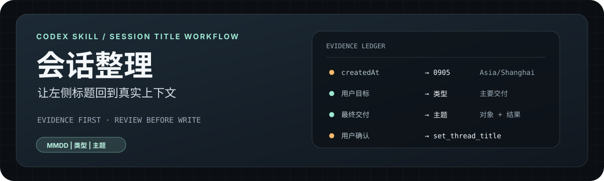

<p align="center">
  
</p>

<p align="center">
  <strong>一个以证据为先、先预览后写回的 Codex 会话标题整理 Skill。</strong>
</p>

<p align="center">
  <code>MMDD | 类型 | 主题</code>
</p>

## 为什么需要它

Codex 自动生成的任务标题，容易变成长句、临时措辞或泛化名称。**会话整理**读取任务的真实目标和最终交付，把标题压缩成适合侧边栏识别的一行。

它只整理标题，不接管项目：不修改对话正文、项目名称、项目归属、排序、置顶或归档状态。

## 30 秒看懂流程

```text
选择范围
  → 读取元数据与必要上下文
  → 提炼候选标题
  → 输出「原名称 | 新名称」预览表
  → 用户确认
  → 按任务 ID 写回标题
```

预览阶段不会修改任何任务。没有足够证据时，保留原名称，不强行猜测。

## 快速使用

安装后，在 Codex 的 Skill 选择器中搜索“会话整理”；显式调用时使用内部名称：

```text
$session-title-organizer 整理“个人网站”项目
```

指定范围：

```text
$session-title-organizer 整理这个任务
$session-title-organizer 整理这个项目
$session-title-organizer 整理这个文件夹
$session-title-organizer 整理全部可访问任务
```

指定执行方式：

```text
$session-title-organizer 整理这个项目，使用当前模型
$session-title-organizer 整理全部任务，使用子 Agent
$session-title-organizer 解释这个标题的判断依据
```

未指定子 Agent 时，默认使用当前对话模型。

## 命名规则

格式固定为：

```text
MMDD | 类型 | 主题
```

类型限定为：`功能`、`设计`、`修复`、`优化`、`发布`、`探索`、`文档`、`研究`。

日期优先使用任务的 `createdAt`，按 `Asia/Shanghai` 转换后取四位月日；没有 `createdAt` 时才使用 `updatedAt`。

主题遵循“对象 + 动作/结果”，例如：

```text
0810 | 文档 | AGENTS.md 中文化与语言规范
0812 | 文档 | ClayAI 深色配色参考包
0805 | 研究 | 个人网站工具链与内容定位
```

## 标题如何避免跑偏

判断顺序固定为：

```text
用户真实目标 → 对话最终交付 → 项目上下文
```

这意味着：

- 项目名称只用于确定范围，不会自动成为每个任务的主题；
- 旧标题和助手的中途计划不能替代用户真实目标；
- 主题优先写出具体对象和交付结果，避免“前期探讨”“项目指引中文化”这类泛化名称；
- Skill 会区分项目主题与单个任务主题；
- 主题冲突、上下文不足或置信度不够时，保留原标题；
- 发起本次整理的当前任务默认排除。

用户需要复核时，可以要求解释某一行的时间、目标、结果、类型和主题依据。

## 先分清“侧边栏项目”和“本地文件夹”

这是本 Skill 最重要的范围边界：

- 说“左侧”“侧边栏”“项目”“项目文件夹”，按当前侧边栏项目归属 `projectId` 匹配；
- 说“本地目录”“工作目录”并给出明确路径，才按 `cwd` 匹配；
- session 被移动或迁移后，侧边栏项目范围仍以当前 `projectId` 为准；历史 `cwd` 不能改变它的项目归属；
- 附带侧边栏截图时，截图是范围证据，不是任务 ID；只有成功映射到唯一任务的条目才会进入候选；
- 只有“文件夹”但没有路径或侧边栏上下文时，不擅自按 `cwd` 扫描。

## 四种范围

| 范围 | 匹配方式 |
| --- | --- |
| 单个任务 | 使用任务 ID，或先定位后确认具体任务 |
| 侧边栏项目 | 使用项目 ID 或项目名称，按任务当前 `projectId` 匹配 |
| 本地文件夹 | 用户明确给出路径后，按任务 `cwd` 匹配目录本身及子目录 |
| 侧边栏可见任务 | 将截图中的可见条目映射到唯一任务 ID |
| 全部任务 | 仅处理宿主明确返回且可核验完整的任务集合 |

默认不扩大用户指定的范围。

当 `list_threads` 返回数量达到宿主上限或 50 条时，结果会标记为“可能不完整”。不完整的结果不能用于声称“已整理全部项目会话”，也不能直接执行批量改名。

## 可选的子 Agent

子 Agent 是通用的可选执行通道，不绑定本机的 Provider、模型 ID、插件或 Agent 角色。

- 默认：当前对话模型完成全部流程。
- 指定子 Agent：由宿主环境提供并解析实际执行器。
- 指定 PA 模型：把用户选择的模型配置传给宿主，不在 Skill 中写死实现。
- 只说“便宜模型”：由宿主选择适合短文本整理的低成本配置。
- 子 Agent 只负责读取、提炼证据和生成候选标题。
- 主对话负责审查范围、展示预览、等待确认和最终写回。
- 指定的子 Agent 不可用时，不静默切回当前模型；除非用户允许回退，否则保持标题不变。

为了减少上下文成本，不默认复制完整会话历史：先读元数据，再读主要用户请求和最终交付，只有发生冲突时才深入更早历史。

## 宿主能力要求

运行环境需要提供：

- 发现项目、路径、标题和时间；
- 读取任务的实际对话内容；
- 用户确认后按任务 ID 更新标题；
- （可选）通用子 Agent 委托接口。

Skill 不包含本机凭据、账号配置、绝对路径或固定 Provider 设置。

## 安装

使用 Skill 安装器从 GitHub 安装：

```bash
python3 /path/to/skill-installer/scripts/install-skill-from-github.py \
  --repo shrekcg/session-title-organizer \
  --path . \
  --name session-title-organizer
```

也可以将本目录复制到目标 Codex 环境的 skills 目录，并保留目录名 `session-title-organizer`。

安装后，宿主通过 `agents/openai.yaml` 显示中文名称“会话整理”，英文目录名作为稳定的内部标识。

## 文件结构

```text
session-title-organizer/
├── SKILL.md
├── README.md
├── agents/
│   └── openai.yaml
└── assets/
    └── readme/
        └── hero.svg
```

Hero 是流程示意图，不代表运行统计或产品截图；真正的标题证据来自宿主提供的任务内容。

## 限制

- Skill 不能访问宿主未公开的任务或对话。
- 标题质量依赖宿主提供的对话读取结果。
- `list_threads` 的返回上限可能导致项目或全部任务结果不完整；不完整时会阻止批量改名。
- 子 Agent、PA 模型、可用 Provider 和实际成本由宿主环境决定。
- UI 是否显示中文名称，取决于宿主是否读取 `agents/openai.yaml`；内部名称始终是 `session-title-organizer`。

## License

本项目采用 [MIT License](./LICENSE)，允许他人复制、修改、发布和再分发。
